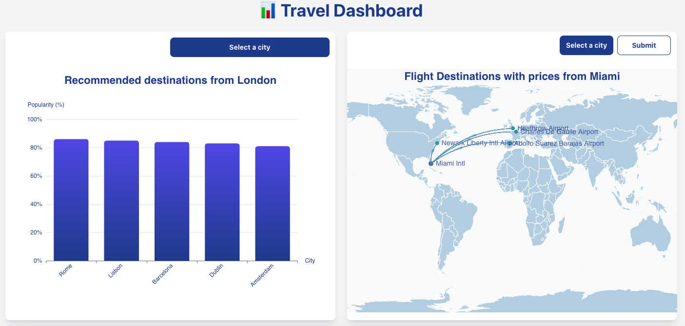
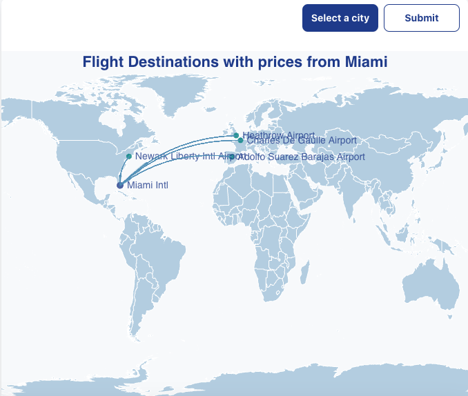
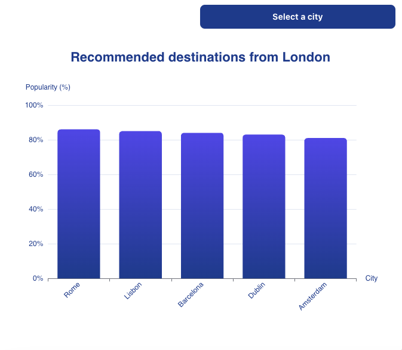

# **Travel Dashboard – Exploring ECharts & Server Actions**

A React application for visualizing travel data using interactive charts.

## Table of Contents

- [Overview](#overview)
- [Features](#features)
- [Why This Project?](#why-this-project)
- [Project Setup](#project-setup)
- [Tech Stack](#tech-stack)
- [Installation](#installation)
- [Screenshots](#screenshots)
- [Travel Bar Chart](#travel-bar-chart)
- [Travel Geo Chart](#travel-geo-chart)
- [Known Issues](#known-issues)

## **Overview**

This project was created as part of my preparation for an interview, where one of the key requirements was **experience with chart libraries**, specifically **ECharts**. Since I had not used ECharts before, I decided to build this **mini-project** to gain hands-on experience and be well-prepared for the interview.

Additionally, I wanted to incorporate my **recent learnings about Next.js Server Actions and Forms**, applying them in a **real-world scenario** alongside ECharts.

## **Features**

- 📊 **Data Visualization with ECharts** – Implemented interactive charts for data representation.
- 🌍 **Fetching Data from Amadeus Travel API** – Retrieved and displayed travel-related insights.
- ⚡ **Next.js Server Actions** – Handled API requests efficiently on the server.
- 🎛️ **React Hook Form & Headless UI** – Enhanced user interaction for selecting cities dynamically.

## **Why This Project?**

1. Gain **practical experience** with **ECharts**, the preferred charting library for the role.
2. Implement **Next.js Server Actions**, a feature I recently learned.
3. Strengthen my understanding of **React Hook Form & Headless UI** for modern form handling.
4. Develop a structured approach for consuming and visualizing **real-world API data**.

---

## **Project Setup**

### **Prerequisites**

Ensure you have the following installed:

- **Node.js** (v16+ recommended)
- **npm**
- A valid **Amadeus API Key** (for fetching travel data)

---

## **Tech Stack**

- **Next.js 15** – Framework for server-side rendering & API handling.
- **React & React Hook Form** – Form handling & user interactions.
- **ECharts-for-React** – Data visualization.
- **Headless UI** – Accessible & customizable UI components.
- **Tailwind CSS** – Utility-first styling.
- **Amadeus Travel API** – Real-time travel recommendations.
- **Next.js Server Actions** – API handling on the server.
- **Lodash** – Utility library for JavaScript.
- **clsx** – Utility for conditional classes.

---

### **Installation**

1. Clone the repository:
   ```sh
   git clone https://github.com/yourusername/travel-dashboard.git
   cd travel-dashboard
   ```
2. Install dependencies:
   ```sh
   npm install
   ```
3. Create an `.env.local` file and add your Amadeus API credentials:
   ```sh
   AMADEUS_CLIENT_ID=your_client_id
   AMADEUS_CLIENT_SECRET=your_client_secret
   AMADEUS_API_URL=your_test_api_url
   ```
4. Start the development server:
   ```sh
   npm run dev
   ```

---

## **Screenshots**





---

## **Travel Bar Chart**

### Overview

The Travel Bar Chart project visualizes recommended travel destinations based on popularity. It uses the Amadeus API to fetch recommended locations for a given city.

### Features

- Displays a bar chart of recommended destinations with popularity percentages.
- Utilizes the Amadeus API for fetching data: [Recommended Locations API](https://developers.amadeus.com/self-service/category/flights/api-doc/travel-recommendations/api-reference).

---

## **Travel Geo Map**

### Overview

The Travel Geo Map project visualizes flight destinations on a world map, including flight prices and geocoordinates. It uses two Amadeus APIs to gather the necessary data.

### Features

- Displays a world map with flight destinations and prices.
- Fetches flight destination data with prices using the [Flight Inspiration Search API](https://developers.amadeus.com/self-service/category/flights/api-doc/flight-inspiration-search/api-reference).
- Retrieves geocoordinates and other relevant details using the [Airport and City Search API](https://developers.amadeus.com/self-service/category/flights/api-doc/airport-and-city-search/api-reference).
- The geo map was set up by downloading a map from [GeoJSON Maps](https://geojson-maps.kyd.au/?utm_source=self&utm_medium=redirect) and adding it to the public folder.

---

## **Known Issues**

- Occasionally, API rate limits may cause data fetching errors.
